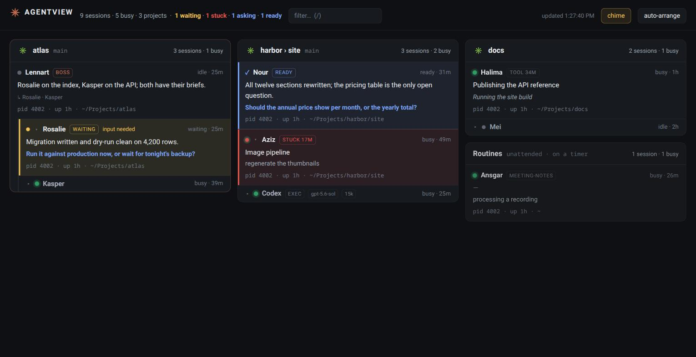

# agentview

A local page showing what every Claude Code session on this machine is working
on, grouped by project — and, since the provider layer, every Codex session
too. Linux only: it reads `/proc`, and a jump talks to WezTerm, tmux or
Konsole.



It generates nothing. Claude Code already writes everything the page shows:

| What | Where it comes from |
|---|---|
| Who is running, and how busy | `~/.claude/sessions/*.json` — the peer files, read through `providers/registry.py` (vendored from cc-agent-names, which defines a live session; `scripts/vendor-registry` refreshes it) |
| What the session is about | the `ai-title` record in its transcript — Claude's own title, rewritten as it learns |
| What it was last asked | the `last-prompt` record |
| Where it left things, and what it wants | the session itself, asked as it stops (see below) |
| Which branch | `gitBranch` on the transcript's user records |

Names come from [cc-agent-names](https://github.com/sweatshop-ai/cc-agent-names),
but nothing here requires it — an unnamed session shows whatever Claude Code
called it.

## After a reboot

tmux-resurrect brings tmux back, but every pane that ran Claude comes back as
a bare shell and the WezTerm windows do not come back at all. `snapshot.py`
covers the rest.

- `agentview-snapshot.timer` runs `snapshot.py save` every 2 minutes. It records
  each interactive Claude session (id, launch flags, name, tmux pane), the
  layout of every tmux session that hosts one, and which WezTerm window and tab
  showed what. Files go to `~/.claude/agentview/snapshots/`, and a save is
  skipped when nothing moved.
- `agentview-restore.desktop` (copied to `~/.config/autostart/`) runs
  `snapshot.py restore --login` once per boot. It takes the last snapshot of
  the previous boot, waits for tmux-continuum, runs `claude --resume` in each
  pane it came from (an idle shell only, never over a running program),
  reopens the WezTerm tabs and seeds cc-agent-names so each session gets its
  old name back. Anything already running is skipped.
- The page shows **↺ reopen N** while sessions from the last boot are missing.
- **⤓ save now** saves the snapshot on the spot, for the minute before you shut
  down: a session started since the last 2-minute tick would otherwise not come
  back. It answers **✓ saved**, or **✓ up to date** when nothing moved since the
  last save. The tooltip says when that was.
- A turn cut off by the shutdown is lost; the conversation up to its last
  finished step is not. Commands and background tasks running at that moment
  are killed, and a resumed session comes back idle: tell it to carry on.
- The same timer names every WezTerm tab after what it hosts: `Name · topic`
  for one session, `project · Name, Name +n` for several. A title you set by
  hand is left alone. `snapshot.py tabs` does it on demand.

`snapshot.py show` lists the last boot's sessions and marks the missing ones.

## Closed today

**⟲ closed N** lists every conversation this boot's snapshots saw that no
longer runs: a tab shut by mistake, a worker nobody went back to. Each line
shows the name it had, Claude's title for it, its directory and when it was
last seen. Names are handed out again during the day, so the title is what
tells two Tareks apart.

- A click resumes it in a new WezTerm tab (`claude --resume <id>` with its old
  flags, in its old directory) and gives it its name back.
- **×** takes one off the list for good, for a session you closed on purpose.
  The ids go to `~/.claude/agentview/dismissed.json`.
- A conversation replaced inside its own terminal (`/clear`, `/resume`) is not
  closed: its process still runs, so it is left out.
- A session that started and ended between two 2-minute saves was never
  written down, and cannot be listed.

A click on a live row whose tmux session no terminal is attached to opens a
WezTerm tab on it (`tmux attach`), instead of selecting a pane nobody can see.

## Search

**⟲ closed N** knows this boot and nothing before it. The box next to it,
*search old conversations…*, searches every interactive conversation this
machine has had, from any day, running ones included. Type three characters
or more; each row is one conversation and shows its name, Claude's title for
it, the project, the day it was last active, and the exchange that matched,
with the matching words marked. The best-matching exchange decides the order.
A click on a row brings that conversation to the front.
Ask in your own words too: the box also finds a conversation by what it
means, when none of your words is in it.

- **A click.** A conversation that runs is jumped to, like a live row: its tab
  comes forward and nothing is opened. A closed one is resumed in a new WezTerm
  tab, the way the closed list does it: `claude --resume <id>` in its old
  directory, under its old name. The flags come from the newest snapshot that
  had it; snapshots go back a few days only, so for an older conversation they
  come from the transcript, which knows the directory it is filed under and the
  permission mode it last ran with (`--permission-mode default` is asked for by
  name, so the resume does not fall back to the settings default). A directory
  that no longer exists is said on the row and nothing is launched. Clicks are
  answered one at a time, and a claude that was launched for the conversation
  and has no peer file yet counts as starting, so a second click while the
  first tab comes up (or two at once) opens nothing more. Each one is logged
  as `revived` (with its `source`, `snapshot` or `transcript`) or `jumped`, in
  `~/.local/state/agentview/events.jsonl`.
- **What counts.** Transcripts whose `entrypoint` is `cli`. `claude -p` runs
  (`sdk-cli`) and subagent transcripts are left out.
- **What is indexed.** One passage is one exchange: a prompt you typed and the
  text of the assistant's reply. Tool calls and results, thinking,
  `<system-reminder>` blocks, hook output, skill bodies and slash-command
  markup are stripped (`/rem notes` stays `/rem notes`). A turn someone else
  started (a peer's message, a finished background task) opens an exchange of
  its own with an empty prompt: the reply is indexed, the message is not.
  An exchange over 6,000 characters is cut into pieces.
- **Matching.** Every word must appear. The last word also matches as a
  prefix from three characters on, so a word still being typed already
  finds something. `"two words"` in quotes is a phrase. Case and accents do
  not matter. That is the keyword half; meaning search (below) adds to it and
  does not need the words to match.
- **Meaning.** The text of a passage, and the words you search for, also go to
  an embedder: a small HTTP service, run on a machine of your own, that turns
  text into a vector (EmbeddingGemma-300m, int4, 768 dimensions). A question
  lands near the passages that say what it says. The two lists of
  conversations, by words and by meaning, are merged by reciprocal rank
  fusion, so a conversation found both ways outranks one found either way,
  and a row found by meaning alone is tagged *by meaning*. A passage counts
  from a cosine similarity of 0.35: on 541 conversations, unrelated queries
  (recipes, football, gibberish) put their best passage at 0.37 or lower, and
  real ones at 0.43 or higher.
  - *What is sent.* A passage's text, to the embedder's document endpoint (at
    most 100 texts a call), and your query, to its query endpoint. The model
    reads the two differently and the wrong endpoint does not fail, it ranks
    worse, so the two paths are two methods. Never a name, a title, a path or
    a project.
  - *Where it is.* Not in this repo, which is public. A local file, mode 0600
    (one others can read is refused, it holds a key):
    `~/.config/tiroir/agentview-embedder.env`, or the path in
    `$AGENTVIEW_EMBEDDER_ENV`, with `EMBEDDER_URL=` (scheme, host, port) and
    `EMBEDDER_API_KEY=`. Read on every search, so a change needs no restart.
  - *One model.* The index is built for one model, `google/embeddinggemma-300m`,
    by the exact name its service reports, at 768 dimensions, with both prompts
    named by the service. A vector that is not a finite number is refused too. Any other service, the bge-m3 one on
    the same machine included, is refused: nothing is embedded and meaning
    search is off with that reason.
  - *Vectors* are stored in the same SQLite file, with the model's identity as
    its model endpoint reports it (model, dimensions, both prompts, maximum
    length). When that changes, every vector is dropped and embedded again:
    vectors from two models are never in one index, nor compared. The identity
    is asked afresh for every query and every batch, before and after; a batch
    made while the model changed is not stored, and a query made while it
    changed is not used.
  - *When it is off.* Not configured, unreachable, not ready, or serving
    another model than the vectors came from: the rows are the keyword ones,
    the answer carries `meaning: {"state": "off", "why": ...}`, and the page
    says so above them. The reason never names the host. A mistyped
    `EMBEDDER_URL` is the same case, not an error. A box that is off
    costs the first search about half a second (its connect timeout), and is
    left alone for the next 30 s; a live one is given 1.5 s to answer.
- **Names.** The name the conversation last had: its peer file while it
  lasts, then agentview's own log (`~/.local/state/agentview/events.jsonl`,
  which goes back as far as its rotation), then whatever Claude Code wrote
  into the transcript. Every run asks again for every conversation, so a
  session renamed while it sat idle is caught. The index keeps the name once
  found, so it outlives both.
- **The index** is one SQLite file with FTS5, `~/.claude/agentview/archive.db`,
  mode 0600 like the transcripts it comes from. Nothing leaves the machine
  except what meaning search sends, described above, and the excerpts that
  [summaries](#summaries) send to Anthropic through the CLI, as any
  conversation you have with Claude Code does.
- **Keeping it current.** `agentview-archive.timer` runs `archive.py update`
  every 5 minutes. It reads only transcripts whose size or mtime moved, and
  only from the start of their last exchange, the one that may still be
  growing. A transcript that moved without growing, or in which anything
  already read changed (a hash covers every byte up to the resume line), was
  rewritten rather than appended to, and is read again from scratch, so
  nothing it no longer says stays findable. One that
  is gone leaves the index. Then it embeds the passages that have no vector
  yet, a batch at a time and committing after each, so a run cut short keeps
  its work. With the embedder off the keyword index is brought up to date all
  the same and the run says so: `archive.py stats` shows it under
  `last_run.meaning`.
- **Speed.** The first run over 534 conversations took 19 s on a quiet
  machine and 38 s on a busy one (load 6.5), and wrote 7,629 passages
  (48 MB); half of it is parsing JSON. A run with nothing new takes about
  0.15 s, most of it reading the log for names, and a search a few
  milliseconds, grouped by conversation in SQL. The search is its own request (`/api/search?q=`) and never
  part of the roster poll.
  With meaning on, the first run also embedded all 7,665 passages of 541
  conversations: 128 s in all, 106 s of it embedding, and the file grew to
  75 MB. Later runs embed only what is new. A search that goes through the
  embedder takes 120 to 160 ms (it reads every vector and scans them with
  numpy), a keyword-only one 3 to 8 ms.

```bash
python3 archive.py update        # what the timer runs; -v lists each file read; embeds what is new
python3 archive.py search words  # what the box would show, meaning included
python3 archive.py stats         # what the index holds, and how the last runs went
```

The schema is written down at the top of `archive.py`. It carries a version,
and an index built by another version is thrown away and rebuilt: it is
derived from the transcripts and holds nothing they do not. The one exception
is the summaries, which cost a model call each and are kept through a rebuild.

### Summaries

Under a result's title sit two lines: what the conversation was about, and
where it stood when it stopped (finished, waiting on you, left half-way). That
is what tells you which of five similar conversations to reopen. A
conversation with no summary yet shows only its title; one that has moved on
since its summary was written shows it dimmed.

- **Who writes them.** `claude -p --model haiku`, through the CLI and the plan
  it is logged in to, never the API: `ANTHROPIC_API_KEY` is taken out of the
  run's environment, so a key in your shell cannot turn it into a paid call.
- **What the model is shown.** Claude's title, the first three things you
  typed, and the last two exchanges (the end of each reply, where it stopped),
  read from the index, so tool output and hook text are already gone. About a
  thousand tokens; never the middle. It goes in on stdin, not on the command
  line where any user could read it in the process list. It does leave the
  machine, as your conversations with Claude do.
- **When.** A conversation that has been quiet for 10 minutes and whose text
  has changed since its last summary. "Changed" means what the model would be
  shown, hashed: a transcript that only grew by tool output costs no call.
  A summary that fails three times for the same text is left alone until the
  text changes; three failures in a row end the run (the quota is gone, or
  nobody is logged in).
- **Pace.** At most 12 per run (`PER_RUN`), and `agentview-summaries.timer`
  runs every 10 minutes. The first backfill, about 510 conversations, is 43
  runs, about 7 hours. Measured on 2026-09-29 over 32 real calls: 3.3 s a call
  (2.9 to 4.1), so about 28 minutes of model time all told, and about a cent a
  call at list price. Afterwards a run finds a handful, or nothing. Most
  recently active first, so the conversations you are likeliest to search for
  are done first.
- **Not a session.** The run is `--safe-mode`: no hooks (so it cannot write a
  team line, log the prompt into the usage study, or fire a chime), no
  plugins, no CLAUDE.md, no MCP servers, and `--tools ""` so there is nothing it
  could run. Thinking is off (`MAX_THINKING_TOKENS=0`): on, Haiku spent 1,700
  to 3,800 tokens thinking about a two-line answer and a call took 10 to 50 s;
  off, the same two lines take 3.5 s. Hooks off does not keep it off the page,
  though: the run writes a peer file like any session, and the page listed one
  in *No project* while it ran. So it runs in `~/.claude/agentview/summaries`,
  and a headless session there is neither listed on the page nor written to
  the log (`providers/claude.py`, `is_helper`).
- **Their transcripts.** Each run is a `claude -p` run, so it leaves an
  `sdk-cli` transcript, in a project folder of its own. The index skips it
  (only `cli` counts) and `retention.py` deletes it after 30 days, like every
  headless transcript (both are tested on a transcript in the shape a run
  leaves). About 510 of them for the backfill; a few a day after.
- **Where they live.** A `summaries` table in the same index file, keyed by
  conversation. It goes with its transcript, and it survives a rebuild of the
  index.

```bash
python3 archive.py summarize             # what the timer runs: at most 12
python3 archive.py summarize --limit 3 -v
python3 archive.py summarize --dry-run   # how many need one; asks nothing
```

## Providers

The page does not know Claude Code. It knows *providers*: one module each
under `providers/`, and each answers one question — which of its sessions are
alive right now, and how is each one doing. The core (`fleet.py`) turns those
facts into rows: the project, the flag, the two lines, the order.

```python
class Provider:
    name: str                    # "claude", "codex" -- no colon
    capabilities: set[str]       # jump, branch, waiting, name, status

    def live(self) -> list[dict]: ...     # the sessions alive now
    def jump(self, session): ...          # optional; None = use the pid
```

A session needs five things: `id` (stable within the provider), `cwd`,
`status` (`busy` | `idle` | `waiting`) and `updatedAt` — milliseconds epoch
of the moment the status changed, not the last activity, because that is the
moment the *ready* tick is keyed to. Everything else is optional and the core
fills in what a provider leaves out; nothing a conforming provider sends can
make the page throw. `extras` is a small dict of strings the page shows as
badges without knowing what they mean — a model, a cost.

Two capabilities change what the core does. Without `waiting` the chime never
rings for that provider, because it cannot tell a question from work. Without
`jump` no row of its can raise a terminal. The others say whether a missing
field is absent or will never exist: a Claude row without a branch is a
session outside a repo, a Codex row without a name is a provider that has no
names.

Every store is keyed `provider:id` — `assign` and `lines` in `config.json`,
`seen.json` — and a bare id left over from before is migrated to `claude:` at
start-up. Each `live()` runs under a time budget and inside a `try`: a
provider that fails a poll gets a *down* badge next to the count and the
others carry on, and its read-marks are left alone until it is back, so a
missed round cannot bring everything you had read back as ready.

### Claude Code

Peer files, transcripts, the `team-line` hook: everything above. It is the
complete case, which is why the contract was designed on the other one.

### Codex

Codex gives the disk and withholds the state. `~/.codex/state_5.sqlite` has a
row per thread — cwd, branch, the first prompt as a title, model, tokens, and
no name on any of the 552 rows here. `~/.codex/sessions/*/rollout-*.jsonl` is
the transcript, written from the moment the session starts; `task_started`
means busy, `task_complete` and `turn_aborted` idle, `agent_message` is what
it said. And `~/.codex/thread-writer-locks/<id>.lock` appears when a session
starts — and **stays behind after a SIGKILL**, so the directory alone lies.

A Codex session is live when its lock exists *and* some process holds its
rollout open. A running `codex` keeps the file in `/proc/<pid>/fd`, and the
file name carries the thread id, so pid and session match exactly. That pid
is what a click jumps with. Where `/proc` cannot be read — hidepid, a
container, another user's process — the row shows without a jump; no pid is
invented. The `/proc` walk costs ~26 ms on this machine and happens once per
new lock, not once per poll: a holder is remembered and re-checked with one
`readlink`, and an orphaned lock is remembered too.

Codex knows busy from idle and nothing about waiting, so it declares neither
`waiting` nor `status`, and a Codex row never rings. It has no hook either,
so its two lines come from the last thing it said — the fallback that fills
the words and never raises the count.

## Run it

```bash
python3 server.py          # http://127.0.0.1:8765
```

Settings live in `config.json`, which is yours and not in the repo:
`config.example.json` is read until you copy it there, and the page writes
its own changes -- pins, labels, assignments -- into `config.json` alone.

Or as a service that survives reboot:

```bash
cp agentview.service ~/.config/systemd/user/
systemctl --user enable --now agentview
```

The search box needs its index kept current (see [Search](#search)):

```bash
cp agentview-archive.service agentview-archive.timer ~/.config/systemd/user/
systemctl --user daemon-reload
systemctl --user enable --now agentview-archive.timer
```

The two lines under each result are written by a second timer, paced so the
backfill does not spend the plan's quota at once (see [Summaries](#summaries)):

```bash
cp agentview-summaries.service agentview-summaries.timer ~/.config/systemd/user/
systemctl --user daemon-reload
systemctl --user enable --now agentview-summaries.timer
```

Bound to `127.0.0.1` deliberately: the page shows your prompts verbatim, which
is client work and occasionally a credential someone pasted into an error.

## Speed

Transcripts are big — 58 MB across ten sessions here, one of them 27 MB — and
the busy ones change every few seconds. Reading them whole on every poll cost
**~9 seconds a round**, which is what made clicking feel broken: the click was
fine, the server was busy re-reading megabytes.

So a transcript is read **once, from its tail**, and after that only the bytes
appended since. A partial final line is left for next time; a file that shrank
or whose opening bytes changed is read again from scratch. Cold **14.4s →
0.84s**, warm **0.28s → 0.03s**.

A jump asks WezTerm and tmux first and only enumerates Konsole over D-Bus if
neither claimed the session, and validates the pid from the peer files alone
rather than building the whole page. The click is also acknowledged before the
request goes out — raising a terminal takes the focus off the page, and a
browser throttles a page it is not showing, so feedback that waits for the
response is feedback you never see.

## What a session says about itself

The two lines under a name answer two questions: **what is this**, and **where
is it now**. Claude Code writes neither. Its `ai-title` is written once and
rarely revisited — of thirteen title lines on this page one morning, five said
nothing about the work (three empty, one `clear-conversation`, one the name of
a slash command) and a sixth described a Dutch 404 while the session was
deploying something else. The second line was worse: a finished session printed
the *last line* of its last message, which is a sign-off as often as an ask, and
a working session printed **your own last prompt back at you**.

So the session is asked. Two hooks, and neither of them interrupts anything.

**`UserPromptSubmit` starts the turn** (`hooks/turn_line.py`). It forgets the
previous line — the prompt you just typed is the answer to whatever the session
was blocked on — and injects one short paragraph asking for the next one. The
session then writes its line as an ordinary action inside the turn it was
already having.

| Field | What it is |
|---|---|
| `did` | Where the work stands. One sentence, in the language of the conversation. It **replaces** the `ai-title` line, which becomes its fallback. |
| `ask` | The one thing it is blocked on, in its own words. |
| `n` | How many things are left for you when its turn ends: a decision, a command to run, a mail to send, a sign-in. Counted even when it has other work, since nothing moves on them once it stops. An offer is not one. |

**Words when there is one, a count when there are more.** A single blocked
question is short enough to answer from the page. Four of them are a trip to the
terminal, and quoting the first of four misrepresents the size of the job — so
the card says `4 answers needed`. It reads as a pair:

```
Design settled through Q16, nothing written yet.
4 answers needed
```

**`n: 0` is the important half.** A card that wants nothing renders one line and
stays short, so the taller cards are the ones asking. That is the alarm, done
with height rather than colour.

**`Stop` only checks** (`hooks/stop_line.py`). If the session wrote its line,
nothing happens. If it did not, the last thing it said is read for a question
and stored as an **unverified** fallback; if there is not even that, the miss is
recorded, so `python3 log.py -k line` says how often the instruction is actually
followed. Nothing here blocks.

**It used to block, and that is the whole reason for this shape.** A blocking
Stop hook works: Claude Code re-invokes the model, which writes the line. It
costs an extra turn at every stop — and Claude Code renders any Stop-hook block
to the user under the heading **`Stop hook error:`**, in every session on the
machine, with no setting that changes it. The instruction now rides along with
the turn instead, so the line costs no extra turn and nothing looks broken.

**A line belongs to a turn, not to a moment.** Every line carries the id of the
turn it was written in, and the page shows it only while that turn is current.
The first version compared the line's age against the peer file's last status
change, which proves only that it was written *somewhere* inside a working
stretch: a session that went idle, busy and idle again between two polls kept
the line from the stretch before, and `waiting` never cleared at all. An
identity settles what an age could only estimate.

**A read ask fills the words and does not raise the count.** Extraction can see
a question. It cannot tell one that stops the session from one that offers to do
more, and a tab that says `(6)` has to mean six. Every line records who wrote
it; only a session speaking for itself joins `waiting` and `stuck` in the header
and the tab title, and leads its block.

**While it works, the line is the call in flight** — *Editing fleet.py*,
*Reading 3 files*, or, for a Bash call, the description the caller already
wrote. Between calls it falls back to the session's own running commentary. An
MCP tool is addressed `mcp__<server>__<tool>`, which is a wire address; the page
says *Gmail users drafts create*.

The lines live in `~/.local/state/agentview/lines/`, beside `seen.json` and
out of `config.json` — that file is yours to hand-edit, this one is written by a
hook. Sessions that are gone are forgotten on the next poll.

## Click a card, get the terminal

Clicking a session raises the terminal it is running in. The page never guesses
how — the server resolves the route per session, because they are not alike:

| Host | How it is asked | Matched by |
|---|---|---|
| WezTerm | `wezterm cli activate-pane` | the session's pty against `tty_name` in `wezterm cli list` |
| tmux | `select-window` + `select-pane`, **then** whatever hosts the attached client | the `tmux` field in the peer file, then the client's tty |
| Konsole | `Window.setCurrentSession` over D-Bus | `Session.processId()` against the session's ancestry |

Then `wmctrl` raises the window. A session inside tmux inside WezTerm needs two
of these in the right order — selecting the tmux pane achieves nothing while the
WezTerm tab stays hidden.

Sessions Claude Code spawned itself have a pty but no window, and are not
clickable. They are also the ones that **survive closing their view** — a
background worker belongs to the daemon, not to a terminal, so exiting detaches
you without stopping it. The uptime is what gives that away.

**Requires X11.** Window raising uses `wmctrl`; under Wayland a client cannot
raise another client's window, and the in-emulator half would still work while
the window stayed where it was. Also needs whichever of `wezterm`, `tmux` and
`qdbus` you actually use — each route is skipped if its tool is missing.

## Arranging it yourself

The order is recomputed every few seconds: whichever project has someone
**busy** leads, ties broken by most recent activity, and `No project` always
sits at the bottom.

That is right until it isn't — the two or three projects you check every day
should be where you left them, not where today's activity puts them. So:

- **`auto-arrange`** in the header stops the shuffling altogether. Held, the
  content still updates — status, titles, flags — and only the positions
  freeze, so a card cannot walk out from under the sentence you are reading.
  Anything that arrives while it is held joins the end rather than pushing into
  the middle. It replaced a Refresh button, which solved nothing: the page
  polls anyway. *Held* is remembered in `config.json`, but the order it froze
  is not — so a reload adopts whatever it paints first and holds **that**.
- **Drag a block** to place it. Everything down to where you dropped it becomes
  **pinned** and stops moving; the rest keeps sorting itself underneath.
- **Click the ✳** on a pinned block to let it go again.
- **Click a project name** to rename it. The name you type is a label —
  the real key underneath does not change, so a rename never orphans its pin.
- **Click the line under a session** to write your own. It replaces
  Claude's generated title *and retitles that terminal tab*, so the page and
  the tab never disagree.

Clicking anywhere *else* in a session still raises its terminal — the two
never overlap, because a terminal arriving in front steals the focus and would
close the field you are typing in.

All of it lands in `config.json`, so it survives restarts and you can edit it
by hand.

**An override on a session dies with the session.** It is keyed by `sessionId`,
which is gone once you close that Claude. A project rename is keyed by the
project and lives forever.

## A boss and its team

A session registered as a boss by the claude-boss plugin coordinates other
sessions and does no implementation work itself. On the page it **leads its
project block** whatever the activity, carries a `boss` badge, and names the
team it dispatches to; that team renders indented beneath it, so the block has
the shape of the team instead of being a flat list of eight equals. A worker
whose boss sits in another block cannot be nested there, so it says `↳ Lennart`
in words instead.

**A worker's `ready` stays folded.** It keeps the blue tick, so the boss's
block shows at a glance which of his team have reported back, but it does not
open a card: that ✓ is his to act on, not yours. `waiting` and `stuck` still
open on a worker — a permission prompt is answered by you, whoever dispatched
the work.

Neither fact is a guess:

- **Boss**: the marker claude-boss writes when a boss registers,
  `pm/.boss-sessions/<session id>` under the Claude config dir — a regular
  file of yours, never a symlink or a directory. Every claude-boss hook acts on
  that file alone, so the badge means what the hooks mean. A session that
  typed `/boss` but never registered is not marked; neither is one that only
  reads the skill's files.
- **Team**, from the transcript: the `to` of every `SendMessage` that session
  has made, liveliest correspondent first, minus anyone no longer running and minus other bosses —
  two bosses exchanging a message is not a chain of command.

The message graph alone would not do: workers message **each other** as much as
they message the boss, so the hub of the graph is not the boss. Only the
marker says who is running the team.

## Routines keep to themselves

A systemd timer firing `claude -p` is a session like any other, and there are
six of them here — `nightly-report` every 20 minutes, `gpu-watch`
every 10, and the daily ones. They run from `~`, which is no project, so they
used to land in **No project**: the pile that means *assign me*, which is the
one thing a routine never needs.

So they get a block of their own, at the very bottom — below `No project`,
because that pile is asking you for something and a routine is asking for
nothing. Each row is badged with the routine that started it, and the block
takes no pin, no rename and no drop.

Two signals are needed to call one, and both must agree. The peer file says
`entrypoint: sdk-cli` where a terminal says `cli` — that only proves it is
headless. The *name* comes from the script above it in the process tree,
`~/.claude/routines/nightly-report.sh` → `nightly-report`. `claude -p` typed by
hand is headless too, and calling that a routine would be a guess.

**Nothing has to clean them up.** A run lasts three or four minutes — twenty
when a transcription is in flight — and the page lists a session only while
its pid answers, so the card goes on its own the moment the run ends.

## Which transcripts are kept

Left alone, Claude Code deletes every transcript 30 days after it was last
written, interactive or not, and a conversation that is gone cannot be
reopened. So the deletion is split in two:

- **Every interactive conversation is kept.** `cleanupPeriodDays` in
  `~/.claude/settings.json` is set to `36500`. There is no value that means
  *never*: `0` fails validation, and the settings reference says to pick a
  large number. A hundred years will do.
- **Headless runs go after 30 days.** `agentview-retention.timer` runs
  `retention.py --delete` every night at 03:30, or at the next boot if the
  laptop was off. It deletes a top-level transcript under
  `~/.claude/projects/` that has not been written for 30 days and whose
  records all say `entrypoint: sdk-cli`, together with its session folder
  (subagent transcripts and spilled tool results). Those are routine runs and
  `claude -p` calls, about three quarters of the transcripts on disk.

Anything else is kept: a transcript with a single `cli` record, one that names
no entrypoint, one with a line that does not parse (it could have been the line
that said `cli`, or one over 64 MB, which is not read; the largest here is
1.5 MB), and one that is not named by a session id. So is a
transcript, session folder or project folder that is a link. `~/.claude/projects`
itself may be one, to another disk say: it is opened once and held, and nothing
below it is followed. Each project is opened once and worked on through that handle,
so a path swapped for a link halfway through leads nowhere.

A headless session resumed by hand just as the job reaches it keeps what the
resume writes. The transcript is renamed first and checked again under its new
name; anything written to it before the rename shows there, and it is put back.
After the rename nothing can write to it: Claude Code appends by path and holds
no file open, so a resume starts a new transcript under the old name, which the
job never touches. The renamed file is read through once more, because a size and
a modification time can be put back by whoever rewrote it and what it says cannot. A session that cannot be deleted is put back as it was and
reported, the rest of the run carries on, and the run exits 1.

Each transcript is handled on its own. Whatever goes wrong with one, an error
of any kind, memory running out, a warning that cannot be written, is reported
and that one is left as it was; it does not stop the others.

A session folder is looked over before anything in it is deleted, because
deleting a folder cannot be undone halfway: every directory in it has to be
readable, writable and searchable, and none may be another filesystem mounted
inside it. A folder that fails the look is kept whole, with its transcript.

Four limits stay, all of them rare:

- That look is not repeated while the folder is deleted: someone who mounts a
  filesystem there in the milliseconds between the two can have it emptied, and
  a process of yours that keeps a transcript open for writing can change it
  after the last check. Both take a process of yours doing it on purpose.
- The look reads permission bits and ACLs, not inode flags. A file marked
  immutable or append-only (`chattr +i`, which only root can set) inside a
  session folder passes it, and the delete stops there with the files before it
  already gone. What is lost is part of a headless session that was due to go
  anyway; the transcript is put back and the next night tries again. None of the
  6,572 entries under `~/.claude/projects` carried such a flag on 2026-09-29.
- An empty directory without write permission is refused although it could be
  removed. The session is kept until someone changes the mode.
- A disk that fails while a session is being deleted, and again while it is
  being put back, leaves it under a `.retention-` name; the warning names it.

What each run deleted is in `journalctl --user -u agentview-retention`.

To set it up, add `"cleanupPeriodDays": 36500` to `~/.claude/settings.json`
first; without it Claude Code keeps deleting interactive transcripts after
30 days. Then, from a checkout at `~/Projects/agentview`, which is where the
units look, as the other units here do:

```bash
python3 retention.py --dry-run     # what the next run would delete; deletes nothing
mkdir -p ~/.config/systemd/user
cp agentview-retention.{service,timer} ~/.config/systemd/user/
systemctl --user daemon-reload
systemctl --user enable --now agentview-retention.timer
```

The same setting governs the rest of what Claude Code sweeps after 30 days
(`file-history/`, `plans/`, `paste-cache/`, `session-env/`, `tasks/`, and so
on), so those now stay too. Together they held about 35 MB on 2026-09-29,
against 3.0 GB of transcripts.

## Finding one

Type in the box (or press **`/`**) to filter. It matches a project's name, a
session's name, its title, its last prompt, the branch and the path — from
**three characters** on, because fewer than that matches nearly everything and
only makes the page flicker while you type.

Sessions needing you are counted across *everyone*, not just what survived the
filter: a filter must never hide something that is stuck.

Each session also shows **how long it has been up**. A background worker two
days old reads very differently from a tab opened a minute ago — and it is the
usual explanation for a session that will not go away.

## What the mark in front of a name means

Claude Code writes four statuses — `busy`, `waiting`, `idle`, `shell` — and
`idle` is the whole problem: it means *finished, your turn* and *abandoned on
Tuesday* with the same grey dot. So the page works out one flag per session:

| Mark | What it means | Where it comes from |
|---|---|---|
| **blue ✓ ready** | It finished, and you have not looked since | `idle`, and not seen since it stopped |
| **amber waiting** | Something on screen is asking | status `waiting` — at once if it names what it wants |
| **red stuck Nm** | It thinks it is working and it is not | `busy`, transcript silent, **and nothing running** |
| **grey tool Nm** | A tool call has been going a very long time | an unanswered `tool_use` that is still the newest thing said |
| **green, breathing** | Working | `busy` |

**Ready is keyed to the moment it stopped**, not to the session
(`~/.local/state/agentview/seen.json`). A session that works again and stops
again carries a new `statusUpdatedAt`, so it comes back as ready by itself —
nothing has to be cleared and nothing can go stale. Clicking a card marks it
seen, whether or not the jump lands. A ready row prints **the last thing the
session said to you** rather than the last thing you said to it: on a finished
session, the newer of the two is the handover — unless the session wrote its
own line, which is better than either.

**`waiting` does not always mean waiting for *you*.** Claude Code writes a
`waitingFor` string — `input needed`, `sandbox request`, the dialog's own
label — whenever something is really on screen, and the page prints it. A
`/btw` helper sits in `waiting` for a few seconds and names nothing, so an
unnamed wait still serves `"waiting_after_seconds": 20` before it is flagged.

**`shell` is not what it sounds like.** It is `idle` with a background job the
session started still running — Claude Code's own taxonomy calls a background
`local_bash` task a *shell*. The turn is over, so it can be ready; the running
job earns a small `bg` badge and nothing more.

**Motion means working, and only working.** The busy dot breathes slowly and a
soft highlight travels through the name. Waiting and stuck nudge, barely — the
colour is the alarm; anything stronger is a thing you learn to stop seeing. A
still page means nothing is running.

**The page has two sounds, and they are the same bell.**

- **A session that starts waiting rings**: two strokes, high then low, with a
  long decay — the cabin chime when the seatbelt sign comes on, not a
  doorbell.
- **A session that finishes ticks**: one stroke, gone in a third of a second.
  Something arrived, and it is not asking you for anything.

Either sounds **once**, for whoever has just started waiting or finishing:
never for the ones already on screen when you open the page, and never again
while that same session sits there. Five landing in one poll is one sound, not
five, and when a question and a finished turn arrive together you hear the
question. `chime` in the header turns both off (it says *muted* then), and the
setting lives in `config.json` with the pins.

A browser makes no sound at all until you have interacted with the page, so
the first click anywhere arms it. If a chime is due before that has happened,
the button turns red and says **allow sound** — clicking it is both the
gesture the browser wanted and the switch.

**A running tool call is not a stuck session.** The transcript is silent for the
whole of a tool call, so silence alone proves nothing — a session six minutes
into `timeout 580 ...` looks exactly like a hung one from outside. What tells
them apart is a `tool_use` with no `tool_result` answering it yet. Only when
that has been outstanding absurdly long is it worth mentioning, and then it is
news, not an alarm: no tint, no beat, just a grey badge.

The transcript's mtime is the heartbeat here, and it has to be: `updatedAt` in
the peer file **does not move while a session works** — a session busy for ten
minutes looks identical to one hung for ten minutes if you only read that.

**A background session may show its own title as its name.** Claude Code names
a `bg` session a moment after starting it, and until then its name is the
conversation title — which is why a `/btw` helper can appear twice over. The
page prints the title once when the two are identical, and the real name
arrives on the next refresh.

**Idle is never stuck.** A session idle for two days is finished or abandoned;
flashing it forever would only teach you to ignore the flashing.

`"stuck_after_minutes": 5` sets how long silence with nothing running is
allowed; `"long_tool_minutes": 20` sets when a running tool call is worth
mentioning.

## Size

`config.json` carries the page's own scale:

```json
{ "zoom": 1.5 }
```

Set it there rather than zooming in the browser, and keep the browser itself at
100% — the two multiply, and 150% twice over is 225%, which drops the grid to a
single column. The value is substituted server-side, so the page never renders
at the wrong size first and then jumps.

## Shelves — how a project gets its name

The hard part is that a working directory is not a project name.

`~/Projects/clients/harbor` is the **harbor** project, but its git root is
`clients` — which would collapse every client into one block. Its basename
works, until `~/Projects/clients/acme/site` shows up as `site` and collides
with the unrelated site project.

So `config.json` declares which directories are **shelves**: places that hold
projects without being one.

```json
{ "shelves": ["~", "~/Projects", "~/Projects/clients"] }
```

## Filling the columns

Blocks are packed, not flowed: each one is measured at the width it will have
and handed to whichever column is currently shortest. A CSS grid gave every
block in a row the height of the tallest one in it; CSS columns balanced by
their own rules and left slack that a block could not break into. Packing
keeps the bottom edges roughly level, and a project that appears while you are
watching lands in the gap rather than at the foot of the last column.

The DOM order is therefore a layout detail, not the order you read — so
dragging a block to pin it works off the painted order the page kept, never
off `querySelectorAll`.

A project is the first directory below the deepest shelf containing the cwd.
Anything deeper becomes a breadcrumb, which is exactly the client/project
distinction: **acme › site**. A session sitting *on* a shelf has no project
and lands in the `No project` block near the bottom — ad-hoc work, and it is
not hidden. Routines sit lower still, in a block of their own.

Add a shelf whenever a directory starts holding projects instead of being one.

## When something looks wrong

Nothing on this page is generated, so when it says something strange the
answer is usually in what it read, or in what a click actually ran. Both are
written down:

```bash
python3 log.py            # the last 60 events
python3 log.py -f         # follow
python3 log.py -k error -k slow
python3 log.py -w Vera    # everything mentioning one session
```

`~/.local/state/agentview/events.jsonl`, one JSON object per line, rotated
at 5 MB. It records four things, and each one is there because it is what you
go looking for:

| Kind | Why it is kept |
|---|---|
| `session.seen` / `session.gone` / `status` / `waitingFor` | Sampled from the peer files every two seconds by a thread of its own, so the history exists whether or not a browser was open. A routine that ran for four minutes at 03:00 left no trace at all before this. |
| `action` / `retitle` / `jumped` | Every POST, with what it asked for and what actually ran on the terminal. A tab that ends up called something surprising can be traced to the click that did it — which is how two tabs came to be called `RIGA`. |
| `error` / `page.error` | Exceptions, including JavaScript ones, which used to be invisible: the poll stops, the page goes quietly stale, and nothing anywhere says why. Repeats are collapsed — the first one is the news, the next four hundred are noise. |
| `slow` | An operation over its budget, and **no line at all** when it was fast. The 9-second poll that made clicking feel broken would have written a line a round. |

Silence is the normal state of the file.

## Tests

```bash
python3 -m unittest discover -s tests
```

`tests/ui_smoke.py` is separate: it drives the real page with Playwright
against a running server — rename, line override, drag-to-pin, unpin, folding,
the routines block — and is not part of `unittest discover`. Run it with
`python3 tests/ui_smoke.py`. It puts back everything it touched, **including
the tab titles it renamed**: an override does not only live in `config.json`.

The unit tests cover the things worth covering: route selection for each
terminal (including tmux-inside-WezTerm and a headless session with nowhere to
go), project resolution (including the `acme › site` and on-a-shelf
cases), reading the summary records out of a transcript, telling a routine
from a hand-run `claude -p`, a boss from a session that has merely read the
skill, the provider contract (a minimal session fills every field the page
reads, a provider that raises or stalls is a badge and not a blank page, a
Codex lock with nobody behind it is an orphan), the retention job (an
interactive transcript is never deleted, whatever its age, and neither is one
that also carries a `cli` record, names no entrypoint, has a line that does not
parse, is a link, or is written to while it is judged), and the
log — that a heartbeat alone says nothing, that a repeated
error is written once, and that a fast operation writes no line at all.
The archive's tests run on a made-up transcript holding one of every record
kind: what is kept and what is stripped, that only `cli` transcripts count, a
growing conversation read from its last exchange, a rewritten one read again,
names, ranking, and a query that cannot be a syntax error, through the real
`/api/search` route. The meaning tests run against a stand-in embedder that
speaks the real one's HTTP contract on a throwaway port: which endpoint each
path calls (and that only passage text is sent), a model change rebuilding
every vector, one batch never holding more than 100 texts, and the embedder
being unreachable, silent, not ready, or another model, each of which leaves
the keyword hits and says meaning is off. The reopen tests go through the real
`/api/reopen` route with WezTerm replaced by a recorder: a running conversation
jumps and is never resumed, a closed one opens from a snapshot or from its
transcript alone, a missing directory launches nothing, and two clicks at once,
or a click on a conversation whose claude is still starting, open nothing more.
The summaries' tests hand the run a stand-in for the model
and look at what comes out: which conversations are asked for and when, that a
run is paced, that what the model is shown is bounded and free of machine text,
that a summary survives a rebuild and goes with its transcript, the exact
command that is run (CLI, Haiku, hooks off, thinking off, conversation on
stdin, no API key), and that a summary run is not a card on the page.

**Every test points at the code the page actually calls.** There used to be a
second, full-file scanner that nothing called, and the summary tests ran
against *that* — so they stayed green while the live one carried a badge bug
for the whole of its life. If a test can only be written against a function
the page does not use, the function is the problem.
